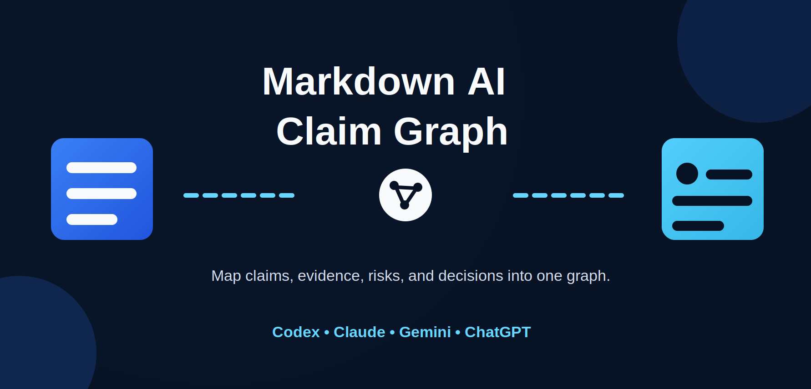

# Markdown AI Claim Graph



A graph-native skill for building typed claim graphs from Markdown analyst files.

Markdown AI Claim Graph does one thing: it constructs a claim graph and renders that graph as tables, Mermaid, JSON, and a graph-derived decision.

## Installation

Install this skill into your Codex skills directory as `markdown-ai-claim-graph`.

### Option 1: Clone into `~/.codex/skills`

```bash
git clone https://github.com/puwarun/markdown-ai-claim-graph.git ~/.codex/skills/markdown-ai-claim-graph
```

### Option 2: Copy this folder into an existing skills directory

Place this repository at:

```text
~/.codex/skills/markdown-ai-claim-graph
```

The final structure should look like:

```text
~/.codex/skills/markdown-ai-claim-graph/
├── SKILL.md
└── agents/openai.yaml
```

### Verify

```text
Use $markdown-ai-claim-graph to build a claim graph from these Markdown analyst files and output node and edge tables, Mermaid, JSON, and the final decision.
```

## Primary Output

The standard output order is:

1. Node Table
2. Edge Table
3. Mermaid Graph
4. JSON Graph
5. Decision Summary

This project is organized around those outputs.

## How to Use

Markdown AI Claim Graph is used by giving an AI assistant two or more Markdown analysis files and asking it to build a graph-native reasoning map from them.

The graph is the primary output.

### Basic Prompt

```text
Use Markdown AI Claim Graph with the attached Markdown analysis files.

Context:
<Briefly describe what the files are about>

Goal:
Build a graph-first review from the analysis.

Output:
1. Node Table
2. Edge Table
3. Mermaid Graph
4. JSON Graph
5. Decision Summary

Rules:
- Extract claims, evidence, risks, recommendations, and decisions as nodes
- Connect nodes with explicit relationships
- Show where analysts agree or disagree
- Do not write a long narrative report first
- Keep the graph as the main output
```

## Graph Model

### Node Types

- `Analyst`
- `File`
- `Topic`
- `Claim`
- `Evidence`
- `Risk`
- `Recommendation`
- `Decision`

### Edge Types

- `supports`
- `contradicts`
- `qualifies`
- `based_on`
- `recommends`
- `warns_about`
- `depends_on`
- `mitigates`
- `leads_to`
- `belongs_to`

## Workflow

1. Create source nodes from input Markdown files.
2. Extract topics, claims, evidence, risks, recommendations, and decisions as nodes.
3. Connect those nodes with typed edges.
4. Render the same graph as tables, Mermaid, and JSON.
5. Write the decision summary from the rendered graph.

## What The Graph Captures

- analyst provenance
- file provenance
- claim structure
- support and contradiction
- qualification and dependency
- risk and mitigation
- recommendation flow
- decision logic

## Example Prompt

```text
Use $markdown-ai-claim-graph to build the claim graph for these analyst files. Show the node table first, then the edge table, Mermaid, JSON, and finally the decision summary.
```

## Included Examples

- `examples/codex_review.md`
- `examples/claude_review.md`
- `examples/claim_graph_output.md`

## Repository Layout

```text
.
├── assets/
│   ├── banner.svg
│   ├── icon-small.svg
│   └── icon.svg
├── examples/
│   ├── claim_graph_output.md
│   ├── claude_review.md
│   └── codex_review.md
├── README.md
├── SKILL.md
└── agents/
    └── openai.yaml
```

## Main Files

- `SKILL.md`: graph workflow and output contract
- `agents/openai.yaml`: UI metadata and default prompt
- `examples/`: source Markdown files plus graph output example
