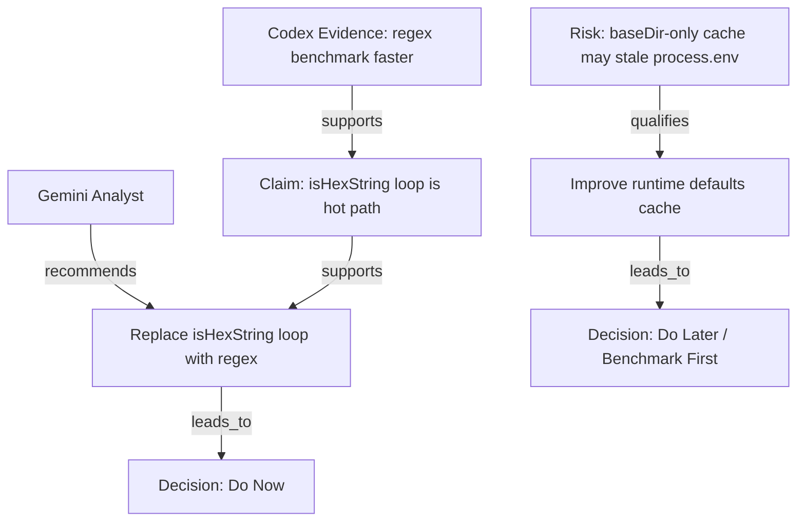

# Markdown AI Claim Graph


A graph-native skill for building typed claim graphs from Markdown analyst files.

Markdown AI Claim Graph does one thing: it constructs a claim graph and renders that graph as tables, Mermaid, JSON, and a graph-derived decision.

## Installation

Install this skill into your Codex skills directory as `markdown-ai-claim-graph`.

### Option 1: Clone into `~/.codex/skills`

```bash
git clone https://github.com/puwarun/markdown-ai-claim-graph.git ~/.codex/skills/markdown-ai-claim-graph
```

### Option 2: Copy this folder into an existing skills directory

Place this repository at:

```text
~/.codex/skills/markdown-ai-claim-graph
```

The final structure should look like:

```text
~/.codex/skills/markdown-ai-claim-graph/
├── SKILL.md
└── agents/openai.yaml
```

### Verify

```text
Use $markdown-ai-claim-graph to build a claim graph from these Markdown analyst files and output node and edge tables, Mermaid, JSON, and the final decision.
```

## Primary Output

The standard output order is:

1. Node Table
2. Edge Table
3. Mermaid Graph
4. JSON Graph
5. Decision Summary

This project is organized around those outputs.

## How to Use

Markdown AI Claim Graph is used by giving an AI assistant two or more Markdown analysis files and asking it to build a graph-native reasoning map from them.

The graph is the primary output.

### Basic Prompt

```text
Use Markdown AI Claim Graph with the attached Markdown analysis files.

Context:
<Briefly describe what the files are about>

Goal:
Build a graph-first review from the analysis.

Output:
1. Node Table
2. Edge Table
3. Mermaid Graph
4. JSON Graph
5. Decision Summary

Rules:
- Extract claims, evidence, risks, recommendations, and decisions as nodes
- Connect nodes with explicit relationships
- Show where analysts agree or disagree
- Do not write a long narrative report first
- Keep the graph as the main output
```

### Example: Codex + Gemini Analysis

Input files:

- `codex_analyst.md`
- `gemini_analyst.md`

Prompt:

```text
Use Markdown AI Claim Graph to analyze codex_analyst.md and gemini_analyst.md.

Context:
Both files are performance analyses of an encryption library.

Goal:
Create a graph that shows:
- which claims are shared
- which recommendations conflict
- which risks qualify the recommendations
- what should be done now, later, conditionally, or avoided

Output:
1. Node Table
2. Edge Table
3. Mermaid Graph
4. JSON Graph
5. Decision Summary
```

### Thai Usage Example

```text
ใช้ Markdown AI Claim Graph วิเคราะห์ไฟล์ .md ที่แนบมา

Context:
ไฟล์เหล่านี้เป็นผลวิเคราะห์จาก AI หลายตัวเกี่ยวกับ performance ของ encryption library

Goal:
แปลงผลวิเคราะห์ทั้งหมดให้เป็น graph โดยแยก claim, evidence, risk, recommendation และ decision

Output:
1. Node Table
2. Edge Table
3. Mermaid Graph
4. JSON Graph
5. Decision Summary

เงื่อนไข:
- ไม่ต้องเขียนรายงานยาวก่อน
- ให้ graph เป็น output หลัก
- แสดงให้ชัดว่า AI เห็นตรงกันตรงไหน และขัดแย้งกันตรงไหน
- สรุปว่าอะไรควรทำตอนนี้ ทำทีหลัง ทำแบบมีเงื่อนไข หรือควรหลีกเลี่ยง
```

### Example Output Structure

#### Node Table

| ID | Type | Source | Text | Confidence |
|---|---|---|---|---|
| A1 | Analyst | `codex_analyst.md` | Codex Analyst | High |
| A2 | Analyst | `gemini_analyst.md` | Gemini Analyst | High |
| C1 | Claim | Gemini | `isHexString()` loop is a hot path | Medium |
| E1 | Evidence | Codex | Benchmark shows regex is faster than manual loop | High |
| R1 | Risk | Codex | Runtime defaults cached by `baseDir` only may stale `process.env` | High |
| REC1 | Recommendation | Shared | Replace `isHexString()` loop with regex | High |
| D1 | Decision | System | Do Now | High |

#### Edge Table

| From | Relation | To |
|---|---|---|
| A2 | recommends | REC1 |
| E1 | supports | C1 |
| C1 | supports | REC1 |
| R1 | qualifies | REC2 |
| REC1 | leads_to | D1 |

#### Mermaid Graph



#### JSON Graph

```json
{
  "nodes": [
    {
      "id": "A1",
      "type": "Analyst",
      "source": "codex_analyst.md",
      "text": "Codex Analyst",
      "confidence": "high"
    },
    {
      "id": "C1",
      "type": "Claim",
      "source": "gemini_analyst.md",
      "text": "`isHexString()` loop is a hot path",
      "confidence": "medium"
    },
    {
      "id": "E1",
      "type": "Evidence",
      "source": "codex_analyst.md",
      "text": "Benchmark shows regex is faster than manual loop",
      "confidence": "high"
    },
    {
      "id": "REC1",
      "type": "Recommendation",
      "source": "shared",
      "text": "Replace `isHexString()` loop with regex",
      "priority": "do_now"
    }
  ],
  "edges": [
    {
      "from": "E1",
      "relation": "supports",
      "to": "C1"
    },
    {
      "from": "C1",
      "relation": "supports",
      "to": "REC1"
    }
  ]
}
```

#### Decision Summary

```md
## Decision Summary

### Do Now
- Replace `isHexString()` manual loop with regex
- Merge duplicated RSA option helper functions
- Extract shared encryption/decryption preparation logic

### Do Later
- Improve runtime defaults cache only after confirming the current path is still hot
- Optimize key path resolution only if profiler shows measurable impact

### Conditional
- Add AES-key caching only if real traffic reuses the same `secretCode`
- Use worker threads only if throughput or event-loop blocking becomes a production issue

### Avoid
- Do not cache runtime defaults by `baseDir` only
- Do not weaken RSA settings purely for speed without an explicit security decision
```

## Two-Pass Cross-Aware Review

### What it is

Two-Pass Cross-Aware Review is an optional advanced workflow for cases where you want stronger disagreement detection before building the final claim graph.

In this workflow, each AI analyst first produces an independent Markdown analysis. Then each analyst reviews the other analyst's file and revises its own output before Markdown AI Claim Graph builds the final graph.

The final goal is still the same:

1. Node Table
2. Edge Table
3. Mermaid Graph
4. JSON Graph
5. Decision Summary

### When to use it

Use this workflow when:

- the topic is complex
- the decision affects production, security, architecture, or performance
- multiple AI agents give different recommendations
- you want stronger disagreement detection
- you want graph-ready inputs that already include cross-review context

### Workflow

#### Pass 1: Independent Analysis

Each AI agent analyzes the target project independently and writes its own Markdown analysis file.

Example output files:

- `codex_analyst.md`
- `gemini_analyst.md`

Each independent file should include:

- key claims
- evidence
- risks
- recommendations
- initial verdict
- graph-ready summary

#### Pass 2: Cross-Aware Revision

Each AI agent reads the other analyst's Markdown file and updates its own file.

Typical flow:

- Codex reads `gemini_analyst.md` and updates `codex_analyst.md`
- Gemini reads `codex_analyst.md` and updates `gemini_analyst.md`

Each updated file should include:

- original analysis
- agreements with the other analyst
- disagreements with the other analyst
- strengths of the other analyst's analysis
- weaknesses or missed risks in the other analyst's analysis
- revised verdict
- graph-ready nodes
- graph-ready edges
- decision recommendations

#### Final Step: Claim Graph Generation

After both analyst files are updated, use Markdown AI Claim Graph to generate:

1. Node Table
2. Edge Table
3. Mermaid Graph
4. JSON Graph
5. Decision Summary

### Copy/Paste Prompts

#### Codex Independent Analysis

```text
Analyze this project independently and write your findings to codex_analyst.md.

Focus on:
- key claims
- evidence
- risks
- recommendations
- initial verdict
- graph-ready summary

Do not compare with other AI analysis yet.
Keep the output suitable for Markdown AI Claim Graph.
```

#### Gemini Independent Analysis

```text
Analyze this project independently and write your findings to gemini_analyst.md.

Focus on:
- key claims
- evidence
- risks
- recommendations
- initial verdict
- graph-ready summary

Do not compare with other AI analysis yet.
Keep the output suitable for Markdown AI Claim Graph.
```

#### Codex Cross-Review Update

```text
Read gemini_analyst.md, compare it with codex_analyst.md, and update codex_analyst.md.

Add a Cross-Review section containing:
- agreements with Gemini
- disagreements with Gemini
- strengths of Gemini's analysis
- weaknesses or missed risks in Gemini's analysis
- revised Codex verdict
- graph-ready nodes
- graph-ready edges
- decision recommendations

Keep the file suitable for Markdown AI Claim Graph.
```

#### Gemini Cross-Review Update

```text
Read codex_analyst.md, compare it with gemini_analyst.md, and update gemini_analyst.md.

Add a Cross-Review section containing:
- agreements with Codex
- disagreements with Codex
- strengths of Codex's analysis
- weaknesses or missed risks in Codex's analysis
- revised Gemini verdict
- graph-ready nodes
- graph-ready edges
- decision recommendations

Keep the file suitable for Markdown AI Claim Graph.
```

#### Final Claim Graph Generation

```text
Use Markdown AI Claim Graph to analyze codex_analyst.md and gemini_analyst.md.

Create:
1. Node Table
2. Edge Table
3. Mermaid Graph
4. JSON Graph
5. Decision Summary

Compare:
- agreements
- disagreements
- strengths and weaknesses
- risks
- final recommended actions

The graph is the primary output. Do not write a long narrative report first.
```

### Expected Output Files

```text
codex_analyst.md
  Independent Codex analysis + Codex cross-review of Gemini

gemini_analyst.md
  Independent Gemini analysis + Gemini cross-review of Codex

claim_graph.md
  Final graph-native output containing Node Table, Edge Table, Mermaid Graph, JSON Graph, and Decision Summary
```

### Notes and Best Practices

- Run independent analysis first to avoid circular dependency
- Do not ask both agents to review each other before both initial files exist
- Keep each analysis structured and graph-ready
- Prefer short claims, explicit evidence, clear risks, and concrete recommendations
- Use this workflow only when deeper analysis is worth the extra token cost
- Keep the final output graph-first and decision-oriented

## Graph Model

### Node Types

- `Analyst`
- `File`
- `Topic`
- `Claim`
- `Evidence`
- `Risk`
- `Recommendation`
- `Decision`

### Edge Types

- `supports`
- `contradicts`
- `qualifies`
- `based_on`
- `recommends`
- `warns_about`
- `depends_on`
- `mitigates`
- `leads_to`
- `belongs_to`

## Workflow

1. Create source nodes from input Markdown files.
2. Extract topics, claims, evidence, risks, recommendations, and decisions as nodes.
3. Connect those nodes with typed edges.
4. Render the same graph as tables, Mermaid, and JSON.
5. Write the decision summary from the rendered graph.

## What The Graph Captures

- analyst provenance
- file provenance
- claim structure
- support and contradiction
- qualification and dependency
- risk and mitigation
- recommendation flow
- decision logic

## Example Prompt

```text
Use $markdown-ai-claim-graph to build the claim graph for these analyst files. Show the node table first, then the edge table, Mermaid, JSON, and finally the decision summary.
```

## Included Examples

- `examples/codex_review.md`
- `examples/claude_review.md`
- `examples/claim_graph_output.md`

## Repository Layout

```text
.
├── assets/
│   ├── banner.svg
│   ├── icon-small.svg
│   └── icon.svg
├── examples/
│   ├── claim_graph_output.md
│   ├── claude_review.md
│   └── codex_review.md
├── README.md
├── SKILL.md
└── agents/
    └── openai.yaml
```

## Main Files

- `SKILL.md`: graph workflow and output contract
- `agents/openai.yaml`: UI metadata and default prompt
- `examples/`: source Markdown files plus graph output example
