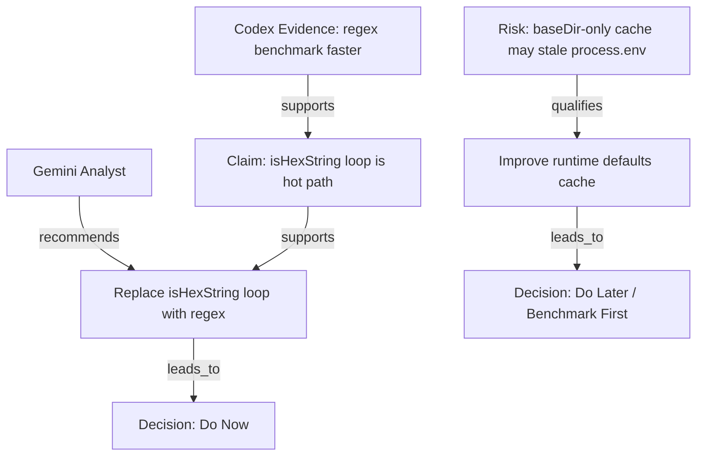

# Markdown AI Claim Graph

[English](README.md)


สกิลแบบ graph-native สำหรับสร้าง claim graph แบบมีชนิดข้อมูลชัดเจนจากไฟล์วิเคราะห์ Markdown

Markdown AI Claim Graph มีหน้าที่หลักอย่างเดียวคือสร้าง claim graph แล้วแสดงผลกราฟนั้นออกมาเป็นตาราง, Mermaid, JSON และ decision ที่สรุปจากกราฟ

## การติดตั้ง

ติดตั้งสกิลนี้ไว้ในโฟลเดอร์ Codex skills ของคุณในชื่อ `mag`

### วิธีที่ 1: Clone ไปที่ `~/.codex/skills`

```bash
git clone https://github.com/puwarun/markdown-ai-claim-graph.git ~/.codex/skills/mag
```

### วิธีที่ 2: คัดลอกโฟลเดอร์ไปไว้ใน skills directory ที่มีอยู่แล้ว

ให้นำ repository นี้ไปวางที่:

```text
~/.codex/skills/mag
```

โครงสร้างสุดท้ายควรเป็นแบบนี้:

```text
~/.codex/skills/mag/
├── SKILL.md
└── agents/openai.yaml
```

### ตรวจสอบการใช้งาน

```text
ใช้ $mag เพื่อสร้าง claim graph จากไฟล์วิเคราะห์ Markdown เหล่านี้ และแสดง Node Table, Edge Table, Mermaid, JSON และการตัดสินใจสุดท้าย
```

## ผลลัพธ์หลัก

ลำดับผลลัพธ์มาตรฐานคือ:

1. Node Table
2. Edge Table
3. Mermaid Graph
4. JSON Graph
5. Decision Summary

เอกสารและ workflow ของโปรเจกต์นี้ยึดลำดับผลลัพธ์นี้เป็นหลัก

## วิธีใช้งาน

Markdown AI Claim Graph ใช้งานโดยให้ AI assistant อ่านไฟล์วิเคราะห์ Markdown อย่างน้อย 2 ไฟล์ แล้วสั่งให้สร้าง graph-native reasoning map จากไฟล์เหล่านั้น

กราฟคือผลลัพธ์หลัก

### Prompt พื้นฐาน

```text
Use Markdown AI Claim Graph with the attached Markdown analysis files.

Context:
<Briefly describe what the files are about>

Goal:
Build a graph-first review from the analysis.

Output:
1. Node Table
2. Edge Table
3. Mermaid Graph
4. JSON Graph
5. Decision Summary

Rules:
- Extract claims, evidence, risks, recommendations, and decisions as nodes
- Connect nodes with explicit relationships
- Show where analysts agree or disagree
- Do not write a long narrative report first
- Keep the graph as the main output
```

### ตัวอย่าง: Codex + Gemini Analysis

ไฟล์ input:

- `codex_analyst.md`
- `gemini_analyst.md`

Prompt:

```text
Use Markdown AI Claim Graph to analyze codex_analyst.md and gemini_analyst.md.

Context:
Both files are performance analyses of an encryption library.

Goal:
Create a graph that shows:
- which claims are shared
- which recommendations conflict
- which risks qualify the recommendations
- what should be done now, later, conditionally, or avoided

Output:
1. Node Table
2. Edge Table
3. Mermaid Graph
4. JSON Graph
5. Decision Summary
```

### ตัวอย่างการใช้งานภาษาไทย

```text
ใช้ Markdown AI Claim Graph วิเคราะห์ไฟล์ .md ที่แนบมา

Context:
ไฟล์เหล่านี้เป็นผลวิเคราะห์จาก AI หลายตัวเกี่ยวกับ performance ของ encryption library

Goal:
แปลงผลวิเคราะห์ทั้งหมดให้เป็น graph โดยแยก claim, evidence, risk, recommendation และ decision

Output:
1. Node Table
2. Edge Table
3. Mermaid Graph
4. JSON Graph
5. Decision Summary

เงื่อนไข:
- ไม่ต้องเขียนรายงานยาวก่อน
- ให้ graph เป็น output หลัก
- แสดงให้ชัดว่า AI เห็นตรงกันตรงไหน และขัดแย้งกันตรงไหน
- สรุปว่าอะไรควรทำตอนนี้ ทำทีหลัง ทำแบบมีเงื่อนไข หรือควรหลีกเลี่ยง
```

### ตัวอย่างโครงสร้างผลลัพธ์

#### Node Table

| ID | Type | Source | Text | Confidence |
|---|---|---|---|---|
| A1 | Analyst | `codex_analyst.md` | Codex Analyst | High |
| A2 | Analyst | `gemini_analyst.md` | Gemini Analyst | High |
| C1 | Claim | Gemini | `isHexString()` loop is a hot path | Medium |
| E1 | Evidence | Codex | Benchmark shows regex is faster than manual loop | High |
| R1 | Risk | Codex | Runtime defaults cached by `baseDir` only may stale `process.env` | High |
| REC1 | Recommendation | Shared | Replace `isHexString()` loop with regex | High |
| D1 | Decision | System | Do Now | High |

#### Edge Table

| From | Relation | To |
|---|---|---|
| A2 | recommends | REC1 |
| E1 | supports | C1 |
| C1 | supports | REC1 |
| R1 | qualifies | REC2 |
| REC1 | leads_to | D1 |

#### Mermaid Graph



#### JSON Graph

```json
{
  "nodes": [
    {
      "id": "A1",
      "type": "Analyst",
      "source": "codex_analyst.md",
      "text": "Codex Analyst",
      "confidence": "high"
    },
    {
      "id": "C1",
      "type": "Claim",
      "source": "gemini_analyst.md",
      "text": "`isHexString()` loop is a hot path",
      "confidence": "medium"
    },
    {
      "id": "E1",
      "type": "Evidence",
      "source": "codex_analyst.md",
      "text": "Benchmark shows regex is faster than manual loop",
      "confidence": "high"
    },
    {
      "id": "REC1",
      "type": "Recommendation",
      "source": "shared",
      "text": "Replace `isHexString()` loop with regex",
      "priority": "do_now"
    }
  ],
  "edges": [
    {
      "from": "E1",
      "relation": "supports",
      "to": "C1"
    },
    {
      "from": "C1",
      "relation": "supports",
      "to": "REC1"
    }
  ]
}
```

#### Decision Summary

```md
## Decision Summary

### Do Now
- Replace `isHexString()` manual loop with regex
- Merge duplicated RSA option helper functions
- Extract shared encryption/decryption preparation logic

### Do Later
- Improve runtime defaults cache only after confirming the current path is still hot
- Optimize key path resolution only if profiler shows measurable impact

### Conditional
- Add AES-key caching only if real traffic reuses the same `secretCode`
- Use worker threads only if throughput or event-loop blocking becomes a production issue

### Avoid
- Do not cache runtime defaults by `baseDir` only
- Do not weaken RSA settings purely for speed without an explicit security decision
```

## Two-Pass Cross-Aware Review

### คืออะไร

Two-Pass Cross-Aware Review เป็น workflow เสริมแบบ advanced สำหรับกรณีที่ต้องการจับจุดขัดแย้งให้ลึกขึ้นก่อนสร้าง claim graph สุดท้าย

workflow นี้ให้ AI แต่ละตัวเขียน Markdown analysis ของตัวเองก่อน จากนั้นให้อ่านงานของอีกฝ่ายและปรับปรุงไฟล์ของตัวเองอีกหนึ่งรอบ ก่อนนำไฟล์ที่อัปเดตแล้วเข้าสู่ Markdown AI Claim Graph

เป้าหมายสุดท้ายยังคงเหมือนเดิม:

1. Node Table
2. Edge Table
3. Mermaid Graph
4. JSON Graph
5. Decision Summary

### ใช้เมื่อไร

เหมาะเมื่อ:

- หัวข้อมีความซับซ้อน
- การตัดสินใจกระทบ production, security, architecture หรือ performance
- AI หลายตัวให้คำแนะนำไม่ตรงกัน
- ต้องการตรวจจับ disagreement ให้ชัดขึ้น
- ต้องการ graph-ready inputs ที่มี cross-review context ติดมาด้วยแล้ว

### Workflow

#### Pass 1: Independent Analysis

AI แต่ละตัววิเคราะห์โปรเจกต์อย่างอิสระและเขียนผลลัพธ์ของตัวเองลงไฟล์ Markdown

ตัวอย่างไฟล์:

- `codex_analyst.md`
- `gemini_analyst.md`

แต่ละไฟล์ควรมี:

- key claims
- evidence
- risks
- recommendations
- initial verdict
- graph-ready summary

#### Pass 2: Cross-Aware Revision

AI แต่ละตัวอ่านไฟล์ของอีกฝ่ายแล้วอัปเดตไฟล์ของตัวเอง

ตัวอย่าง flow:

- Codex อ่าน `gemini_analyst.md` แล้วอัปเดต `codex_analyst.md`
- Gemini อ่าน `codex_analyst.md` แล้วอัปเดต `gemini_analyst.md`

ไฟล์ที่อัปเดตแล้วควรมี:

- original analysis
- agreements with the other analyst
- disagreements with the other analyst
- strengths of the other analyst's analysis
- weaknesses or missed risks in the other analyst's analysis
- revised verdict
- graph-ready nodes
- graph-ready edges
- decision recommendations

#### ขั้นสุดท้าย: Claim Graph Generation

หลังจากอัปเดตไฟล์ของทั้งสองฝ่ายแล้ว ใช้ Markdown AI Claim Graph เพื่อสร้าง:

1. Node Table
2. Edge Table
3. Mermaid Graph
4. JSON Graph
5. Decision Summary

### Copy/Paste Prompts

#### Codex Independent Analysis

```text
Analyze this project independently and write your findings to codex_analyst.md.

Focus on:
- key claims
- evidence
- risks
- recommendations
- initial verdict
- graph-ready summary

Do not compare with other AI analysis yet.
Keep the output suitable for Markdown AI Claim Graph.
```

#### Gemini Independent Analysis

```text
Analyze this project independently and write your findings to gemini_analyst.md.

Focus on:
- key claims
- evidence
- risks
- recommendations
- initial verdict
- graph-ready summary

Do not compare with other AI analysis yet.
Keep the output suitable for Markdown AI Claim Graph.
```

#### Codex Cross-Review Update

```text
Read gemini_analyst.md, compare it with codex_analyst.md, and update codex_analyst.md.

Add a Cross-Review section containing:
- agreements with Gemini
- disagreements with Gemini
- strengths of Gemini's analysis
- weaknesses or missed risks in Gemini's analysis
- revised Codex verdict
- graph-ready nodes
- graph-ready edges
- decision recommendations

Keep the file suitable for Markdown AI Claim Graph.
```

#### Gemini Cross-Review Update

```text
Read codex_analyst.md, compare it with gemini_analyst.md, and update gemini_analyst.md.

Add a Cross-Review section containing:
- agreements with Codex
- disagreements with Codex
- strengths of Codex's analysis
- weaknesses or missed risks in Codex's analysis
- revised Gemini verdict
- graph-ready nodes
- graph-ready edges
- decision recommendations

Keep the file suitable for Markdown AI Claim Graph.
```

#### Final Claim Graph Generation

```text
Use Markdown AI Claim Graph to analyze codex_analyst.md and gemini_analyst.md.

Create:
1. Node Table
2. Edge Table
3. Mermaid Graph
4. JSON Graph
5. Decision Summary

Compare:
- agreements
- disagreements
- strengths and weaknesses
- risks
- final recommended actions

The graph is the primary output. Do not write a long narrative report first.
```

### ไฟล์ผลลัพธ์ที่คาดหวัง

```text
codex_analyst.md
  Independent Codex analysis + Codex cross-review of Gemini

gemini_analyst.md
  Independent Gemini analysis + Gemini cross-review of Codex

claim_graph.md
  Final graph-native output containing Node Table, Edge Table, Mermaid Graph, JSON Graph, and Decision Summary
```

### Notes และ Best Practices

- ทำ independent analysis ก่อนเสมอเพื่อหลีกเลี่ยง circular dependency
- อย่าให้ทั้งสอง agent review กันก่อนที่ initial files จะถูกสร้างครบ
- รักษาโครงสร้างของแต่ละ analysis ให้ graph-ready
- ใช้ claims ที่สั้น, evidence ที่ชัด, risks ที่ตรงประเด็น และ recommendations ที่ลงมือทำได้
- ใช้ workflow นี้เมื่อคุณต้องการความลึกเพิ่มจริง ๆ เพราะจะใช้ token มากขึ้น
- ให้ผลลัพธ์สุดท้ายยังคง graph-first และ decision-oriented

## Graph Model

### Node Types

- `Analyst`
- `File`
- `Topic`
- `Claim`
- `Evidence`
- `Risk`
- `Recommendation`
- `Decision`

### Edge Types

- `supports`
- `contradicts`
- `qualifies`
- `based_on`
- `recommends`
- `warns_about`
- `depends_on`
- `mitigates`
- `leads_to`
- `belongs_to`

## Workflow หลัก

1. สร้าง source nodes จากไฟล์ Markdown ที่รับเข้า
2. แยก topics, claims, evidence, risks, recommendations และ decisions ออกมาเป็น nodes
3. เชื่อม nodes เหล่านั้นด้วย typed edges
4. แสดงกราฟเดียวกันในรูปแบบตาราง, Mermaid และ JSON
5. เขียน decision summary จากกราฟที่สร้างแล้ว

## สิ่งที่กราฟนี้เก็บ

- provenance ของ analyst
- provenance ของไฟล์
- โครงสร้างของ claims
- support และ contradiction
- qualification และ dependency
- risk และ mitigation
- flow ของ recommendation
- logic ของ decision

## ตัวอย่างไฟล์ใน repo

- `examples/codex_analyst.md`
- `examples/gemini_analyst.md`
- `examples/claim_graph_output.md`

## โครงสร้าง repository

```text
.
├── assets/
│   ├── banner.svg
│   ├── icon-small.svg
│   └── icon.svg
├── examples/
│   ├── claim_graph_output.md
│   ├── codex_analyst.md
│   └── gemini_analyst.md
├── README.md
├── README.th.md
├── SKILL.md
└── agents/
    └── openai.yaml
```

## ไฟล์หลัก

- `SKILL.md`: workflow ของกราฟและ output contract
- `agents/openai.yaml`: metadata สำหรับ UI และ default prompt
- `examples/`: ตัวอย่าง source Markdown และ graph output
